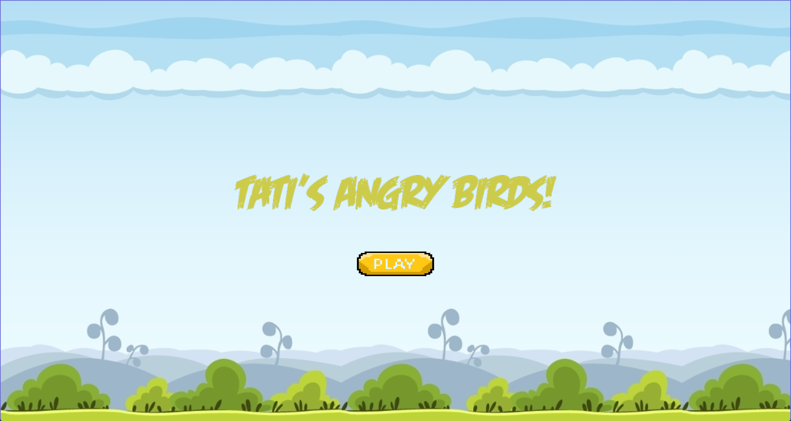
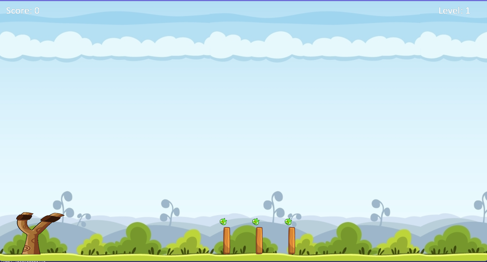
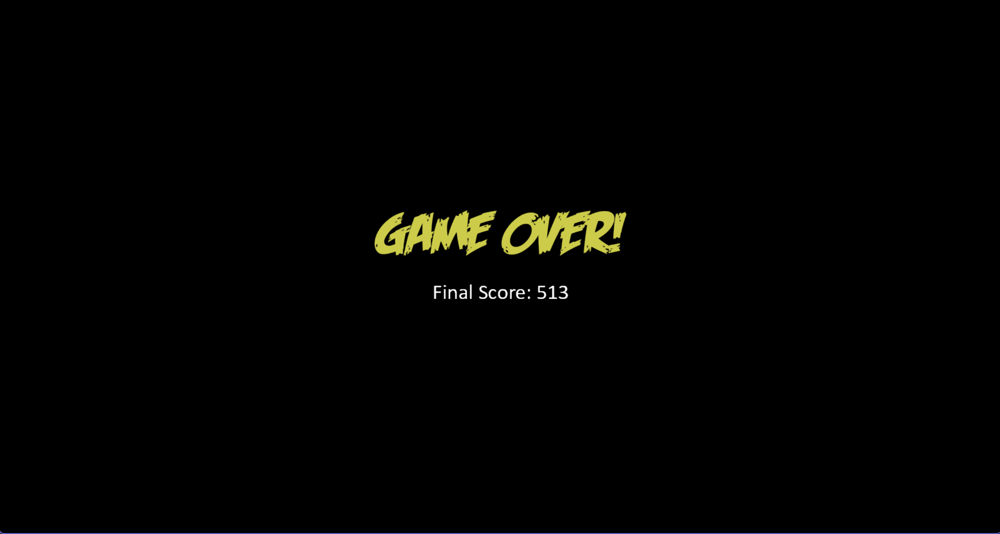

# Infografia - Universidad Privada Boliviana 1er parcial

## Descripción

Este repositorio contiene el código para ejecutar el clon del juego Angry Birds. 

## Instrucciones

Para ejecutar el juego, siga estos pasos:

1. Clone el repositorio en un directorio local.
2. Abra la carpeta completa con Visual Studio code.
3. Cree un entorno virtual para el proyecto o use alguno que ya tenga existente
4. Ejecute el archivo main.py.

Siga las instrucciones para la implementación de la evaluación.

## ¿Qué contiene el juego?

El juego tiene 5 pantallas distintas:
La pantalla de inicio, donde se presiona el botón Play, para iniciar.

Las siguientes tres pantallas, son muy similares, ya que encontramos a los 3 niveles implementados para este juego, solo con la diferencia de que conforme se incrementa el nivel, vemos más columnas y más cerditos.

Y por último tenemos la pantalla de game over, donde al presionar el click izquierdo del mouse, podemos volver a jugar el juego.

## Implementación de características adicionales

Para hacer el juego un poco más interesante, se implementaron 2 tipos de ave, a parte del ave roja que venía ya de base.

### Yellow Bird

Es un ave amarilla, la cual al presionar la tecla espacio se vuelve más rapida. Para seleccionarla, se debe presionar la tecla 2 y se seleccionará está ave.

### Blue Bird

Es un ave celeste, la cual al presionar la tecla espacio, tendrá dos aves más con la misma velocidad. Para seleccionarla, se debe presionar la tecla 3.

## Características no implementadas

Como se puede observar en la pantalla de los niveles, se puede ver la honda en la pantalla. Pero debido a falta de tiempo, no se pudo implementar la lógica de que los tiros solos salgan de esta posición. En un futuro, se podría pensar en una implementación de esta honda, para que el juego se parezca más a le original.

También se podrá encontrar la imagen del ave bomba que tiene Angry Birds, la cual tampoco se logró implementar, pero en versiones futuras, implementar esta ave y otras que Angry Birds tiene haría el juego aún mas interesante.

Tampoco hay alguna manera de perder aún, para esto se estaba pensando en una cierta cantidad de tiempo limite o una cantidad de lanzamientos, para que así los cerditos ganen. Esta es una característica que puede ser añadida más adelante.

